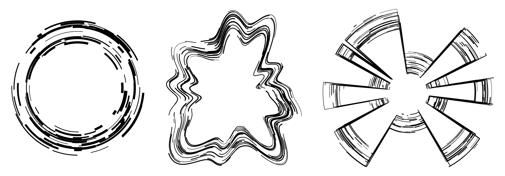
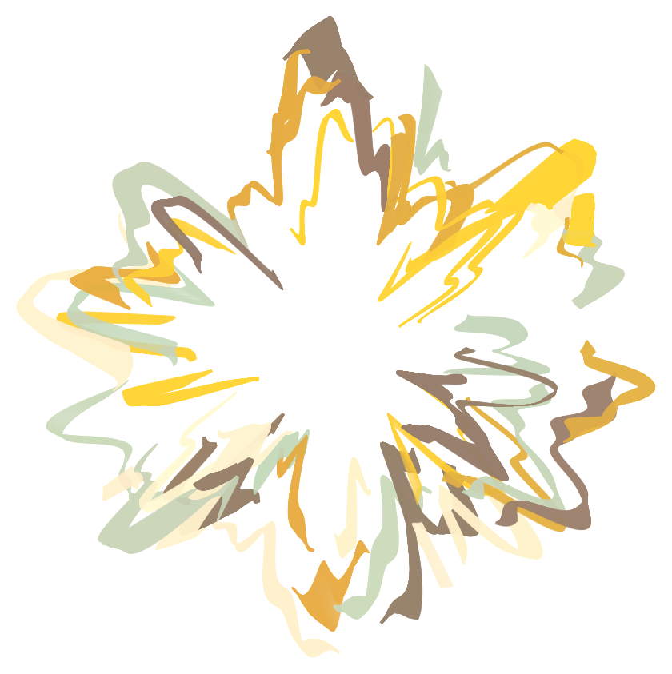
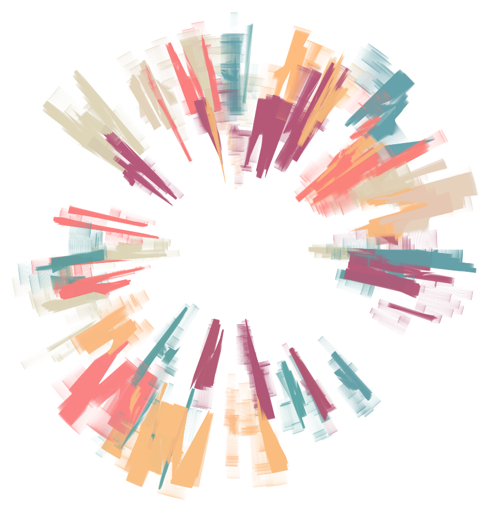
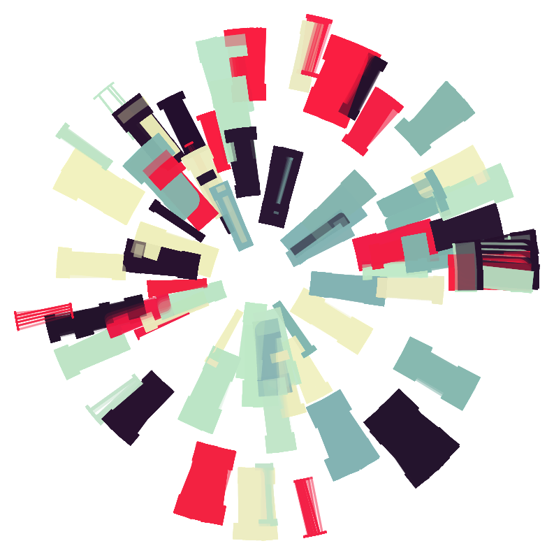

# jam3-lesson-canvas2d

Some code for a workshop on Canvas2D at Jam3. Some of the outputs of the workshop:



Some of the topics include:

- Setting up a retina-scaled Canvas 2D
- Canvas2D API
  - transforms (scale, rotate)
  - rectangle fills
  - paths and line strokes
  - circle rendering
- equation of a circle
- simplex noise

## Usage

```sh
git clone https://github.com/Jam3/jam3-lesson-canvas2d.git
cd jam3-lesson-canvas2d
npm install
npm start
```

Now open `localhost:9966` in your browser.

## Code

The code is broken up into 3 parts:

- Boilerplate and rectangles with `context.fillRect()`
- Arcs with `context.arc()`
- Drawing arcs with noise and `context.lineTo()`

You can see the `lib/solutions` folder for the different steps, or checkout the `final` branch for the final output.

## Further Work

The code here lays the groundwork for slightly more complex generative artwork. By removing the `clearRect` and `fillRect` calls each frame and selecting a different colour palette, you can end up with images like this:






See the `paint` branch for an example.

## License

MIT, see [LICENSE.md](http://github.com/Jam3/jam3-lesson-canvas2d/blob/master/LICENSE.md) for details.
